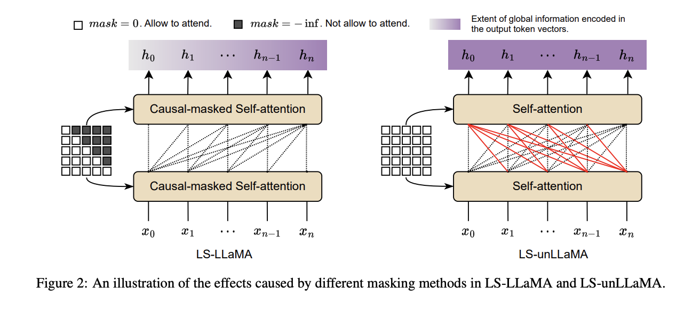

# LS-LLaMA: Label Supervised LLaMA Finetuning

<h2>📢: For convenience, we build a bi-directional LLMs toolkit <a href='https://github.com/WhereIsAI/BiLLM'>BiLLM</a> for language understanding. Welcome to use it.</h2>

<p align="center">

[](https://paperswithcode.com/sota/named-entity-recognition-on-conll03-4?p=label-supervised-llama-finetuning)

[](https://paperswithcode.com/sota/named-entity-recognition-on-ontonotes-5-0-1?p=label-supervised-llama-finetuning)
</p>


<p align='center'>

</p>

## Usage

Our implementation currently supports the following sequence classification benchmarks: 
1. SST2 (2 classes) / SST5 (5 classes)
2. AGNews (4 classes)
3. Twitter Financial News Sentiment (twitterfin, 3 classes)

and token classification benchmarks for named entity recognition (NER): CoNLL2003 and OntonotesV5.

Commands for training LS-LLaMA and LS-unLLaMA on different tasks can follow the templates below:
```console
foo@bar:~$ CUDA_VISIBLE_DEVICES=0 python file_name.py dataset_name model_size
```

`file_name.py` can be one of `unllama_seq_clf.py`, `unllama_token_clf.py`, `llama_seq_clf.py`, and `llama_token_clf.py`, for training LS-LLaMA and LS-unLLaMA on sequence- and token-level classification.

`dataset_name` can be one of `sst2`, `sst5`, `agnews`, `twitterfin`, `conll03`, and `ontonotesv5`.

`model_size` can be `7b` or `13b`, corresponding to LLaMA-2-7B and LLaMA-2-13B.

For example, the following command will train LS-unLLaMA based on LLaMA-2-7B on AGNews for sequence classification:
```console
foo@bar:~$ CUDA_VISIBLE_DEVICES=0 python unllama_seq_clf.py agnews 7b
```

## Implementations

Load Pretrained Models

```python
from transformers import AutoTokenizer
from modeling_llama import (
    LlamaForSequenceClassification, LlamaForTokenClassification,
    UnmaskingLlamaForSequenceClassification, UnmaskingLlamaForTokenClassification,
)


model_id = 'meta-llama/Llama-2-7b'
tokenizer = AutoTokenizer.from_pretrained(model_id)
model = LlamaForSequenceClassification.from_pretrained(model_id).bfloat16()
model = LlamaForTokenClassification.from_pretrained(model_id).bfloat16()
model = UnmaskingLlamaForSequenceClassification.from_pretrained(model_id).bfloat16()
model = UnmaskingLlamaForTokenClassification.from_pretrained(model_id).bfloat16()
```

For more usage, please refer to `unllama_seq_clf.py`, `unllama_token_clf.py`, `llama_seq_clf.py`, `llama_token_clf.py`.

# Citation

```
@article{li2023label,
  title={Label supervised llama finetuning},
  author={Li, Zongxi and Li, Xianming and Liu, Yuzhang and Xie, Haoran and Li, Jing and Wang, Fu-lee and Li, Qing and Zhong, Xiaoqin},
  journal={arXiv preprint arXiv:2310.01208},
  year={2023}
}
```
